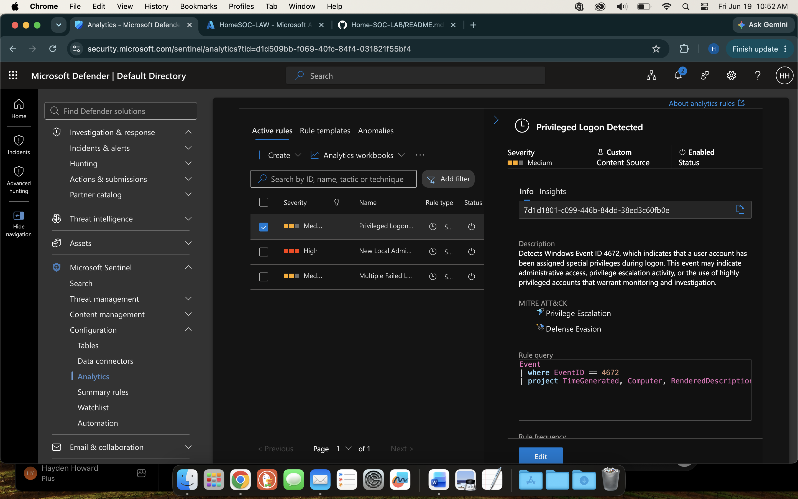
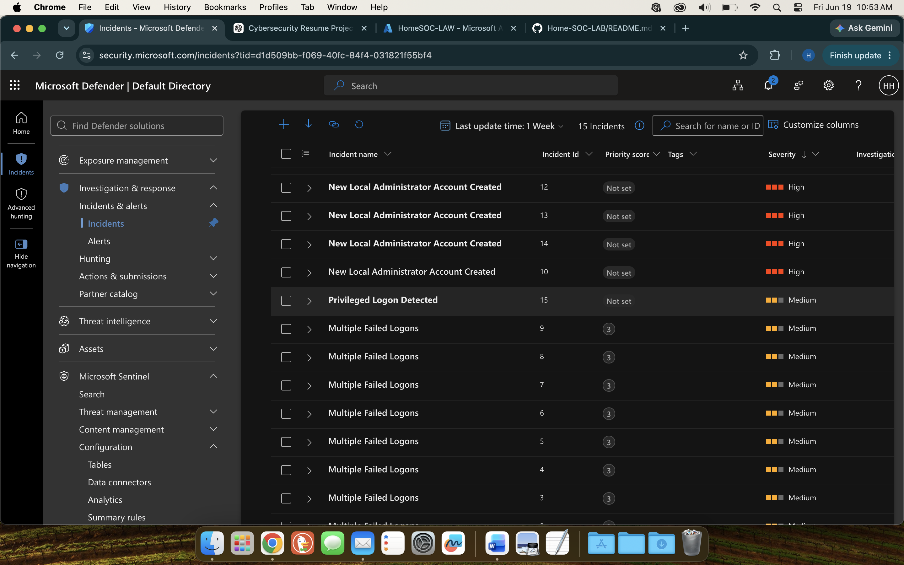

# Privileged Logon Detection

## Overview

This detection identifies Windows Event ID 4672, which is generated when a user logs on and is assigned special privileges. Monitoring privileged logons helps security analysts identify administrative account usage, privilege escalation activity, and potentially unauthorized access to sensitive systems.

## Detection Objective

Detect privileged logon events to improve visibility into administrative activity and identify potential privilege escalation attempts.

## MITRE ATT&CK Mapping

| Tactic               | Technique              |
| -------------------- | ---------------------- |
| Privilege Escalation | T1078 - Valid Accounts |
| Defense Evasion      | T1078 - Valid Accounts |

## Severity

Medium

## Data Source

* Microsoft Sentinel
* Azure Monitor Agent (AMA)
* Windows Security Event Logs
* Log Analytics Workspace

## Event ID

| Event ID | Description                                |
| -------- | ------------------------------------------ |
| 4672     | Special privileges assigned to a new logon |

## KQL Query

```kusto
Event
| where EventID == 4672
| project TimeGenerated, Computer, RenderedDescription
```

## Detection Logic

The rule generates an alert whenever a privileged logon event is observed. Event ID 4672 is commonly associated with administrative accounts and accounts granted elevated permissions.

## Test Procedure

1. Logged into the monitored Windows endpoint using an administrative account.
2. Allowed Windows Security events to be ingested into Microsoft Sentinel.
3. Executed the KQL query in Log Analytics.
4. Verified Event ID 4672 was present.
5. Confirmed Microsoft Sentinel generated an incident.

## Results

The detection successfully identified privileged account logon activity and generated a Microsoft Sentinel incident for analyst review.

## Screenshots

### Analytics Rule



### Sentinel Incident



## Lessons Learned

* Configured custom analytics rules in Microsoft Sentinel.
* Developed KQL queries to identify privileged account activity.
* Validated end-to-end log collection, alerting, and incident generation.
* Gained experience mapping detections to MITRE ATT&CK techniques.
